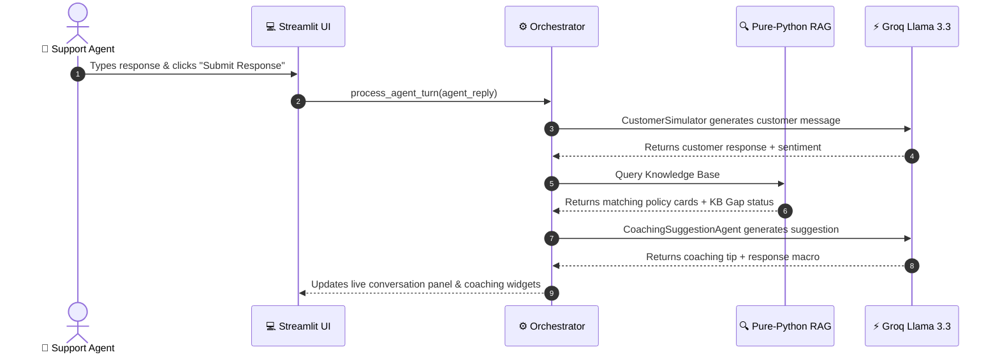

# 📐 CoachAI Architecture & Developer Guide

This document explains the internal architectural design, data flow, and code structure of **CoachAI**.

---

## 🧩 Module Breakdown

### 1. `src/agents/` — Multi-Agent AI Engine (23 Agents)
Each agent is a self-contained, single-responsibility Python class that processes conversation state or transcript logs:

- **`customer_simulator.py`**: Generates realistic, emotionally dynamic customer responses based on persona cards.
- **`jira_bug_generator.py`**: Analyzes transcripts post-session for system glitches and returns structured `JiraBugTicket` models with priority badges.
- **`customer_mind_reader.py`**: Extracts secret internal monologues (`internal_monologue`) vs typed chat text.
- **`multiverse_simulator.py`**: Generates parallel outcome branches (**Timeline A** vs **Timeline B**) with predicted CSAT scores.
- **`auto_pilot_agent.py`**: Pre-fills the agent reply box with a high-empathy, policy-compliant response with one click.
- **`competitor_defection_agent.py`**: Detects churn threats to rivals (Swiggy/UberEats) and auto-issues retention codes (`STAY15`).
- **`fraud_detector.py`**: Flags refund abuse patterns and fake missing food claims.
- **`qa_audit_agent.py`**: Issues official ISO-9001 compliance audit certificates.
- **`predictive_csat.py`**: Predicts CSAT ($1.0 - 5.0\text{ stars}$) and Churn Risk ($\%$) dynamically.
- **`auto_kb_agent.py`**: Auto-drafts new policy cards into `data/knowledge_base/pending/` when search relevance is low.

---

### 2. `src/core/` — Orchestrator & Models
- **`orchestrator.py`**: Central coordinator. When `process_agent_turn()` is called, it triggers the multi-agent pipeline:
  1. `CustomerSimulatorAgent` ➔ Generates customer message.
  2. `IntentSentimentAgent` ➔ Evaluates emotion & frustration.
  3. `KnowledgeRecommendationAgent` ➔ Queries RAG search for policy cards.
  4. `CoachingSuggestionAgent` ➔ Generates turn suggestion & response macros.
  5. `EscalationMonitorAgent` ➔ Computes escalation likelihood.
- **`models.py`**: Pydantic schemas defining all data objects (`Message`, `TurnAnalysis`, `ArcadeTicket`, `JiraBugTicket`, `ISOAuditCertificate`).
- **`llm.py`**: Resilient LLM client wrapper supporting Groq (`llama-3.3-70b-versatile`) with automatic failover to lighter models (`llama-3.1-8b-instant`, `gemma2-9b-it`) and Gemini API.

---

### 3. `src/modules/` — Game Engines & Vaults
- **`survival_game.py`**: Manages the 4-ticket simultaneous Arcade Desk, live countdown timers, HP health bars, quality math $Q$, and power-ups (`Manager Shield`, `Instant Refund Pass`).
- **`hall_of_fame.py`**: Archives top 1% masterclasses ($>90\%$) and failure cases ($<40\%$) into `data/hall_of_fame.json`.
- **`session_config.py`**: Pre-configures 10+ food delivery support scenarios with order context cards.

---

### 4. `src/rag/` — Zero-LlamaIndex Pure-Python Search
- **`knowledge_base.py`**: Implements a zero-dependency in-memory BM25 + TF-IDF hybrid search engine.
  - Sub-5ms retrieval speed.
  - Automatic orange callout badge highlighting (`<mark>`).
  - Automatic Knowledge Base Gap detection when document score $< 0.45$.

---

### 5. `src/ui/` — Streamlit Web Interface
- **`app.py`**: Main application dashboard managing page navigation (`Simulator`, `Arcade Challenge`, `Manual Workspace`, `Transcript Replay`, `Analytics Vault`).
- **`zomato_widgets.py`**: Render functions for Zomato Order Cards, Delivery Rider Status Cards (`Ramesh Kumar • ETA 8 mins`), Zomato Bot Prior Chat Log, and Agent Quick Replies.
- **`panels.py`**: Manages chat message bubbles, emotion avatars, and agent coaching sidebars.

---

## 🔄 Turn-by-Turn Execution Flow

---

## 🧪 Testing Guidelines

To verify system health:
- Run agent tests: `python tests/test_out_of_box_agents.py`
- Run concurrency load test: `python tests/test_load.py`
