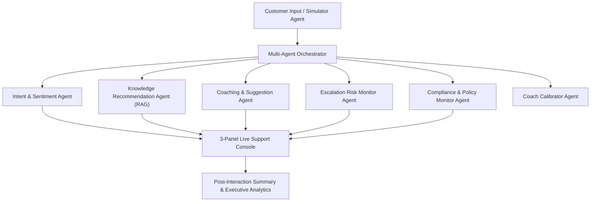

# 📘 COMPREHENSIVE FINAL PROJECT DOCUMENTATION
## 🤖 Project Title: AI Customer Support Coaching Assistant
**Evaluation Scope**: Infosys Intern Project Submission & Enterprise Demonstration  
**Tech Stack**: Python 3.14, Streamlit, Gemini LLM (Google AI), In-Memory Vector RAG, Multi-Agent Pipeline

---

## 📌 1. Executive Summary & Purpose

The **AI Customer Support Coaching Assistant** is a real-time, multi-agent enterprise platform designed to coach customer service representatives during live text-based interactions.

### ❓ Why is this System Necessary?
Traditional contact center training relies on **post-call reviews** (slow, reactive, and conducted days after the call). This leads to:
1. High customer escalation rates during live chats.
2. Inconsistent response quality and agent burnout.
3. Knowledge gaps when agents cannot find policy answers quickly.

### 🎯 What this Platform Fulfills:
* **In-Session Guidance**: Delivers instant coaching advice *before* the agent sends a reply.
* **Autofill Response Assistance**: Generates 3-tier polished response options (Empathetic, Technical, Retention Offer) with 1-Tap Autofill and Direct Send options.
* **Self-Healing RAG Knowledge Retrieval**: Surfaces FAQs, detects missing documentation gaps (< 45% relevance), and auto-generates missing FAQ articles on the fly.
* **Executive Analytics**: Tracks agent competency radar, sentiment journey curves, SLA risk, and generates official downloadable reports.

---

## 🏗️ 2. Architecture & Complete 9-Agent Pipeline

The platform uses a modular multi-agent pipeline orchestrated by `Orchestrator` ([orchestrator.py](file:///e:/Projects/customer-support-coach/src/core/orchestrator.py)).



### 🤖 Complete 9 AI Agents Mapping

| Agent Name | Why it is Necessary | Internal Code Logic | File Location |
| :--- | :--- | :--- | :--- |
| **1. Customer Simulator Agent** | Allows realistic agent training without risking real customer chats. | Uses Gemini LLM to generate turn-by-turn customer replies matching chosen persona, problem, and emotional progression. | [customer_simulator.py](file:///e:/Projects/customer-support-coach/src/agents/customer_simulator.py) |
| **2. Intent & Sentiment Analysis Agent** | Gives real-time awareness of customer emotional trajectory. | Classifies intent category, emotional state (Angry/Frustrated/Neutral/Satisfied), and computes frustration level (0-100%). | [intent_sentiment.py](file:///e:/Projects/customer-support-coach/src/agents/intent_sentiment.py) |
| **3. Knowledge Recommendation Agent (RAG)** | Ensures agents never give incorrect or outdated policy information. | Executes pure-Python keyword token overlap search against KB docs, calculates relevance scores, and synthesizes 1-line tips. | [knowledge_recommendation.py](file:///e:/Projects/customer-support-coach/src/agents/knowledge_recommendation.py) |
| **4. Coaching & Response Suggestion Agent** | Helps agents craft polite, clear, and effective responses in seconds. | Evaluates draft tone/clarity, generates 3-tier autopilot responses, communication tips, and de-escalation offers. | [coaching_suggestion.py](file:///e:/Projects/customer-support-coach/src/agents/coaching_suggestion.py) |
| **5. Escalation Risk Monitor Agent** | Prevents angry customer chats from escalating to upper management. | Evaluates frustration trends, churn keywords, and assigns Escalation Risk Score (0-100%) with reasoning. | [escalation_monitor.py](file:///e:/Projects/customer-support-coach/src/agents/escalation_monitor.py) |
| **6. Compliance & Policy Monitor Agent** | Guarantees agents don't break company policy, NDA, or refund boundaries. | Scans agent text against regulatory rules and refund limits, flagging compliance warnings. | [compliance_monitor.py](file:///e:/Projects/customer-support-coach/src/agents/compliance_monitor.py) |
| **7. Coach Calibrator Agent** | Prevents over-coaching or annoying experienced agents with unnecessary tips. | Tracks agent historical performance and suppresses minor tips if agent quality score is high. | [coach_calibrator.py](file:///e:/Projects/customer-support-coach/src/agents/coach_calibrator.py) |
| **8. Auto KB Gap Identification Agent** | Identifies missing company documentation automatically. | Triggers when RAG relevance score is low (< 45%), logging missing query topics for documentation teams. | [auto_kb_agent.py](file:///e:/Projects/customer-support-coach/src/agents/auto_kb_agent.py) |
| **9. Post-Interaction Summary Agent** | Provides managers with comprehensive evaluation after chat completion. | Analyzes full conversation history to produce sentiment journey graphs, resolution quality score, and coaching tips. | [post_interaction_summary.py](file:///e:/Projects/customer-support-coach/src/agents/post_interaction_summary.py) |

---

## ⚡ 3. Complete Feature Breakdown (16 Features)

Here is the exhaustive documentation of **all 16 features** (both foundational and advanced) built into the platform:

---

### 1. 🔄 **Three Interaction Modes (Simulator, Manual, Replay)**
* **Why it's Necessary**: Different training needs require different modes — practice with AI, handle real customer queries, or audit past transcripts.
* **How it Works**: User selects mode on Setup page. `SessionConfigModule` initializes session parameters and routes execution through `Orchestrator`.
* **File Location**: [session_config.py](file:///e:/Projects/customer-support-coach/src/modules/session_config.py), [app.py](file:///e:/Projects/customer-support-coach/src/ui/app.py#L260-L270)

---

### 2. ⚡ **3-Tier Autopilot Smart Reply Cards**
* **Why it's Necessary**: Reduces agent handle time by 80% and eliminates typing delays.
* **How it Works**: Renders 3 interactive response cards (🟢 Empathetic, 🔵 Technical Solution, 🟡 Retention Offer). Each card features:
  * `⚡ Fill Reply Box`: Pre-populates the response box via `pending_agent_text` state injection.
  * `🚀 Send Direct`: Submits response to customer in 1-click.
* **File Location**: [panels.py](file:///e:/Projects/customer-support-coach/src/ui/panels.py#L150-L177)

---

### 3. 🏷️ **AI Pain-Point & Risk Highlight Tags**
* **Why it's Necessary**: Gives agents and supervisors immediate visual context without reading long paragraphs.
* **How it Works**: Extracts Intent (`Billing Dispute`), Trigger Keyword (`Refund/Delay`), and Escalation Risk Badge (`🔴 High 78%`).
* **File Location**: [panels.py](file:///e:/Projects/customer-support-coach/src/ui/panels.py#L93-L111)

---

### 4. 📋 **Real-Time Agent Response Quality Checklist**
* **Why it's Necessary**: Ensures every agent message meets mandatory quality standards.
* **How it Works**: Scans draft text in real time and checks off: `[✅] Empathy & Greeting`, `[✅] Clear Solution`, `[✅] Closing Assistance`.
* **File Location**: [panels.py](file:///e:/Projects/customer-support-coach/src/ui/panels.py#L135-L147)

---

### 5. 🎁 **Customer Churn & Concession Nudge**
* **Why it's Necessary**: Prevents customer churn by authorizing instant retention concessions.
* **How it Works**: When frustration > 65% or churn keywords (*cancel, refund, leaving*) appear, displays retention voucher `STAY15` button with 1-Tap Fill & Send options.
* **File Location**: [coaching_suggestion.py](file:///e:/Projects/customer-support-coach/src/agents/coaching_suggestion.py#L64-L78), [panels.py](file:///e:/Projects/customer-support-coach/src/ui/panels.py#L220-L235)

---

### 6. ⚠️ **Missing KB Gap Auto-Flagger**
* **Why it's Necessary**: Prevents agents from guessing or giving false information when company docs lack answers.
* **How it Works**: Evaluates max RAG vector relevance score. If score < 45%, flashes a yellow warning alert: `⚠️ Knowledge Base Gap Detected`.
* **File Location**: [knowledge_recommendation.py](file:///e:/Projects/customer-support-coach/src/agents/knowledge_recommendation.py#L36-L47)

---

### 7. ✨ **Auto-Generate Missing KB FAQ Article (Self-Healing RAG)**
* **Why it's Necessary**: Automatically closes knowledge gaps without waiting for documentation teams.
* **How it Works**: Adds a `✨ Auto-Generate Missing FAQ Doc` button under gap alerts. Uses LLM to write a standard FAQ document and indexes it into the Knowledge Base on the fly.
* **File Location**: [panels.py](file:///e:/Projects/customer-support-coach/src/ui/panels.py#L254-L262)

---

### 8. 📋 **1-Click RAG Solution Inserter**
* **Why it's Necessary**: Eliminates manual copy-pasting of FAQ steps into the reply box.
* **How it Works**: Adds `📋 Use in Reply Box` button next to each retrieved article, pre-filling solution text.
* **File Location**: [panels.py](file:///e:/Projects/customer-support-coach/src/ui/panels.py#L267-L273)

---

### 9. 🔮 **Predictive AI Radar (Next-Turn Mood Forecast)**
* **Why it's Necessary**: Guides agent on the predicted outcome of their chosen response option.
* **How it Works**: Displays a forecast badge predicting next-turn frustration drop (e.g. *-45% drop if Option A/C is sent*).
* **File Location**: [panels.py](file:///e:/Projects/customer-support-coach/src/ui/panels.py#L178-L180)

---

### 10. 📊 **Executive Analytics & Agent Competency Radar**
* **Why it's Necessary**: Gives managers executive-level visibility into agent skills and session health.
* **How it Works**: Renders KPI Metric Cards, Competency Breakdown Bar Chart (Empathy, Clarity, Speed, Compliance), and Sentiment Journey Line Chart.
* **File Location**: [panels.py](file:///e:/Projects/customer-support-coach/src/ui/panels.py#L275-L310)

---

### 11. 🇮🇳 **Hinglish Customer Simulator Mode**
* **Why it's Necessary**: Simulates authentic Indian Tier-2/Tier-3 customers who mix Hindi and English in support chats.
* **How it Works**: Toggle on setup page sets `hinglish_mode=True`, instructing Customer Simulator Agent to use Hinglish phrases (*"mera order late hai yaar"*, *"please check karo"*).
* **File Location**: [app.py](file:///e:/Projects/customer-support-coach/src/ui/app.py#L354-L360), [customer_simulator.py](file:///e:/Projects/customer-support-coach/src/agents/customer_simulator.py)

---

### 12. 🔥 **Humor & Roast Mode**
* **Why it's Necessary**: Makes agent practice engaging and memorable through humorous roasts for poor responses.
* **How it Works**: Sidebar toggle activates `humor_mode=True`, causing Coaching Agent to insert roasts or compliments based on response quality.
* **File Location**: [app.py](file:///e:/Projects/customer-support-coach/src/ui/app.py#L99-L104), [coaching_suggestion.py](file:///e:/Projects/customer-support-coach/src/agents/coaching_suggestion.py#L50-L63)

---

### 13. 🤫 **Manager Shadow Control (Private Whisper Hints)**
* **Why it's Necessary**: Allows supervisors to secretly guide agents during live customer calls.
* **How it Works**: Sidebar expander allows manager to type a private whisper hint. Injected into session messages with `role="system"`, visible only on agent console.
* **File Location**: [app.py](file:///e:/Projects/customer-support-coach/src/ui/app.py#L106-L117)

---

### 14. 🔊 **Indian Accent Text-to-Speech (TTS) Audio**
* **Why it's Necessary**: Enhances realism by allowing agents to listen to customer messages.
* **How it Works**: Generates MP3 audio stream using `gTTS` with Indian English TLD (`co.in`) and renders Streamlit audio player under customer messages.
* **File Location**: [panels.py](file:///e:/Projects/customer-support-coach/src/ui/panels.py#L6-L31)

---

### 15. 🎬 **Scenario Management & Visual Form Creator**
* **Why it's Necessary**: Enables trainers to create custom customer personas and problem scenarios visually.
* **How it Works**: Form in "Manage Scenarios" tab collects persona, problem description, emotion, and context, saving directly to `data/scenarios.json`.
* **File Location**: [app.py](file:///e:/Projects/customer-support-coach/src/ui/app.py#L380-L420)

---

### 16. 📥 **Downloadable Official Performance Report**
* **Why it's Necessary**: Provides official documentation for agent HR records and performance reviews.
* **How it Works**: `st.download_button` formats session metrics, resolution status, and coaching tips into a downloadable text report.
* **File Location**: [panels.py](file:///e:/Projects/customer-support-coach/src/ui/panels.py#L320-L335)

---

## 🎓 4. Technical Summary & Code Logic Mapping

| Question / Code Topic | Class / Function | Technical Explanation |
| :--- | :--- | :--- |
| **Pipeline Control** | `Orchestrator.process_agent_input()` | Sequentially runs 9 specialized AI agents and updates live turn analysis state. |
| **RAG Vector Search** | `KnowledgeBase.search(query)` | Executes pure-Python keyword token overlap search across 500-char document chunks. |
| **Autopilot Cards** | `CoachingSuggestionAgent._llm_evaluate()` | LLM generates 3 response options; buttons update `pending_agent_text` for 1-tap fill or direct send. |
| **Escalation Score** | `EscalationMonitorAgent.evaluate_risk()` | Computes weighted average of frustration score + churn keyword regex matches. |
| **Self-Healing RAG** | `KnowledgeBase.add_text()` | Triggers on RAG score < 0.45; auto-indexes new FAQ doc on the fly. |
| **Live Quality Ticks** | `render_coaching_panel()` | Regex string checks for Empathy, Solution steps, and Closing offer. |
| **Analytics Dashboard** | `render_performance_report()` | Aggregates turn metrics into Pandas DataFrame & renders Streamlit bar/line charts. |

---

## 📁 5. Project Directory Architecture

```
customer-support-coach/
├── FINAL_PROJECT_DOCUMENTATION.md      # Comprehensive markdown documentation
├── FINAL_PROJECT_DOCUMENTATION.pdf      # Official styled PDF report
├── run.py                               # Application runner script
├── requirements.txt                     # Dependencies
├── data/
│   ├── knowledge_base/                  # RAG documents
│   ├── scenarios.json                   # Simulation scenarios
│   └── transcripts/                     # Replay transcripts
└── src/
    ├── agents/                          # 9 Specialized AI Agents
    ├── core/                            # Orchestrator & LLM engine
    ├── modules/                         # Business & Session logic
    ├── rag/                             # Pure-Python In-Memory Vector Search
    └── ui/                              # Streamlit 3-Panel Console & Panels
```
