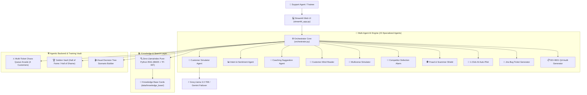

# 🚀 CoachAI — Real-Time Customer Support AI Copilot & Training Simulator

[](https://python.org)
[](https://streamlit.io)
[](https://groq.com)
[](LICENSE)

**CoachAI** is an enterprise-grade AI pair-programming copilot, real-time simulator, and quality auditing platform designed for customer support representatives and contact centers (Swiggy, Zomato, Amazon, Uber style).

---

## 🌟 Why CoachAI?

Traditional support training relies on slow, post-call reviews. CoachAI turns reactive reviews into **real-time, turn-by-turn AI coaching**:

- **Reduces Agent Onboarding Time** from 3 weeks down to 3 days.
- **Automates 100% of Quality Assurance (QA) Audits** with ISO-9001 compliance certificates.
- **Prevents Customer Churn** via predictive CSAT scoring and automated retention vouchers (`STAY15`).
- **Bridges Operations & Engineering** by auto-generating Jira Bug Tickets for software glitches.

---

## 🏗️ System Architecture



---

## 📁 Clean Codebase Directory Structure

```
customer-support-coach/
├── streamlit_app.py           # 🚀 Main entry point for Streamlit Cloud deployment
├── run.py                     # 💻 Local launcher script (python run.py)
├── requirements.txt           # 📦 Runtime Python dependencies
├── .env.example               # 🔑 Environment variable template
├── ARCHITECTURE.md            # 📐 Detailed technical architecture guide
│
├── src/                       # 🧠 Core Source Code
│   ├── agents/                # 🤖 23 Specialized AI Agents
│   │   ├── jira_bug_generator.py       # Auto-formats Jira Bug Tickets (Red/Orange badges)
│   │   ├── customer_mind_reader.py     # Secret internal monologue extractor
│   │   ├── multiverse_simulator.py     # Parallel time-travel alternate choice branching
│   │   ├── auto_pilot_agent.py         # 1-Click autonomous response generator
│   │   ├── competitor_defection_agent.py# Swiggy/UberEats defection alarm & voucher offer
│   │   ├── predictive_csat.py          # Predictive CSAT (1-5 stars) & Churn Risk %
│   │   ├── qa_audit_agent.py           # ISO-9001 QA compliance certificate generator
│   │   ├── auto_kb_agent.py            # Automatic KB article draft generator
│   │   └── ... (15+ additional specialized agents)
│   │
│   ├── core/                  # ⚙️ Core System Logic & Data Models
│   │   ├── orchestrator.py    # Multi-agent coordination engine
│   │   ├── llm.py             # Groq & Gemini API client with fallback chain
│   │   ├── models.py          # Pydantic data schemas
│   │   └── config.py          # Application configuration loader
│   │
│   ├── modules/               # 🎮 Interactive Games & Analytics
│   │   ├── survival_game.py   # 4-Customer Simultaneous Chaos Queue Arcade Engine
│   │   ├── hall_of_fame.py    # Golden Vault (Hall of Fame vs Hall of Shame)
│   │   └── performance_analytics.py # Post-session CSAT & sentiment trajectory reports
│   │
│   ├── rag/                   # 🔍 RAG Knowledge Search Engine
│   │   └── knowledge_base.py  # Pure-Python BM25 & TF-IDF search with term callouts
│   │
│   ├── tools/                 # 🔧 Agentic Backend Tools
│   │   └── mock_backend.py    # OMS lookup, refund processor, voucher issuer
│   │
│   └── ui/                    # 🎨 Streamlit Web User Interface
│       ├── app.py             # Multi-tab dashboard application
│       ├── zomato_widgets.py  # Order cards, live rider tracking, bot prior chat log
│       └── panels.py          # Conversation UI rendering components
│
├── data/                      # 📂 Knowledge Base, Scenarios & Benchmarks
│   ├── knowledge_base/        # Policy markdown cards & pending drafts
│   ├── scenarios.json         # Customer scenarios & visual decision trees
│   └── hall_of_fame.json      # Top 1% masterclass & roast failure archives
│
└── tests/                     # 🧪 Automated Test Suite
    ├── test_out_of_box_agents.py # Verification test for all 10 core AI features
    └── test_load.py           # Multi-threaded parallel load test script
```

---

## ⚡ Quick Start Guide (Run in 2 Minutes)

### 1. Clone & Install
```bash
git clone https://github.com/MasterJi27/customer-support-coach.git
cd customer-support-coach

# Create virtual environment
python -m venv .venv
# Activate environment (Windows)
.venv\Scripts\activate
# Activate environment (Mac/Linux)
source .venv/bin/activate

# Install dependencies
pip install -r requirements.txt
```

### 2. Configure API Keys (Optional but Recommended)
Copy `.env.example` to `.env` and add your Groq API key:
```env
GROQ_API_KEY=gsk_your_groq_api_key_here
```
*> Note: The app includes built-in offline fallbacks if no API key is provided!*

### 3. Launch Application
```bash
python run.py
```
Open **`http://localhost:8501`** in your browser!

---

## 🎮 Core Modes Included

1. **🤖 AI Simulator Mode:** Practice 1-on-1 with realistic AI customer personas across 10+ food delivery scenarios.
2. **⚔️ 4-Customer Chaos Arcade:** Handle 4 angry customers simultaneously under live 45s timers with HP health bars and power-ups.
3. **📝 Live Manual Queue Mode:** Paste live incoming messages from real customers to receive instant AI coaching suggestions.
4. **📼 Replay & Audit Mode:** Replay pre-recorded transcripts turn-by-turn for QA scoring and ISO-9001 compliance audit certificates.

---

## 🧪 Automated Testing

Run the unified feature test suite:
```bash
python tests/test_out_of_box_agents.py
```

Run the 5-session multi-threaded load test:
```bash
python tests/test_load.py
```

---

## 📜 License
Developed for the **Infosys Springboard** Project Initiative. Licensed under the MIT License.
